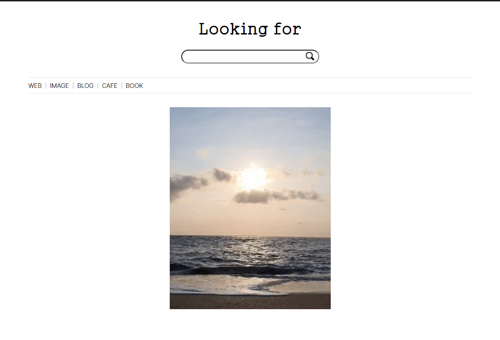
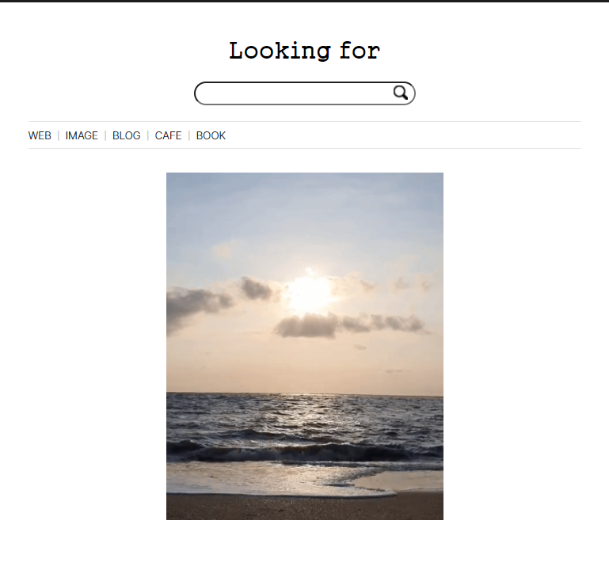
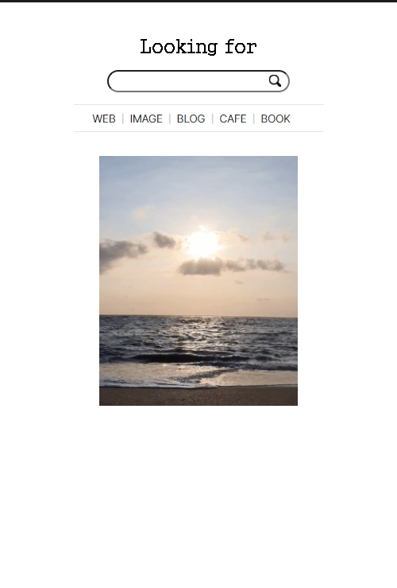
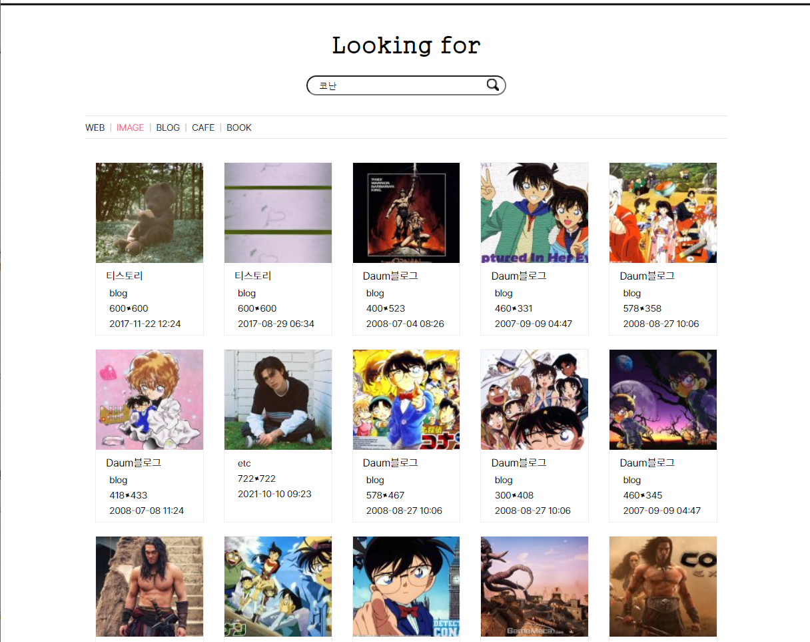
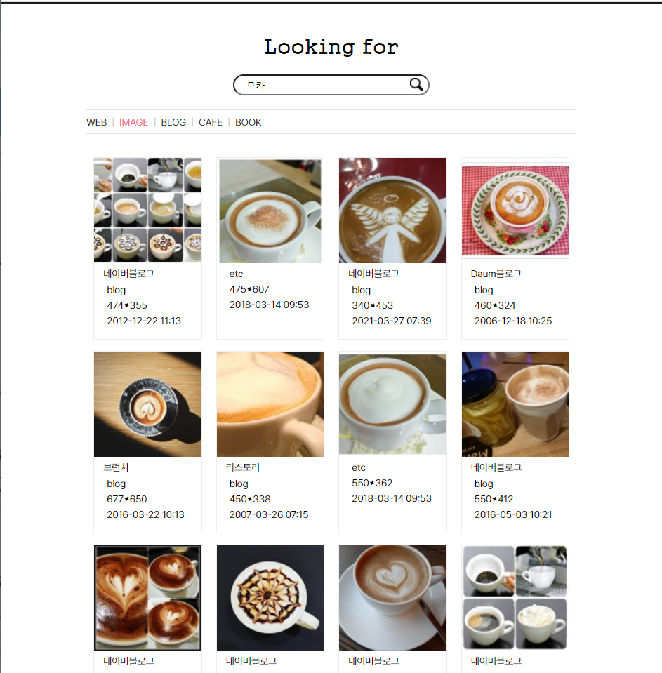
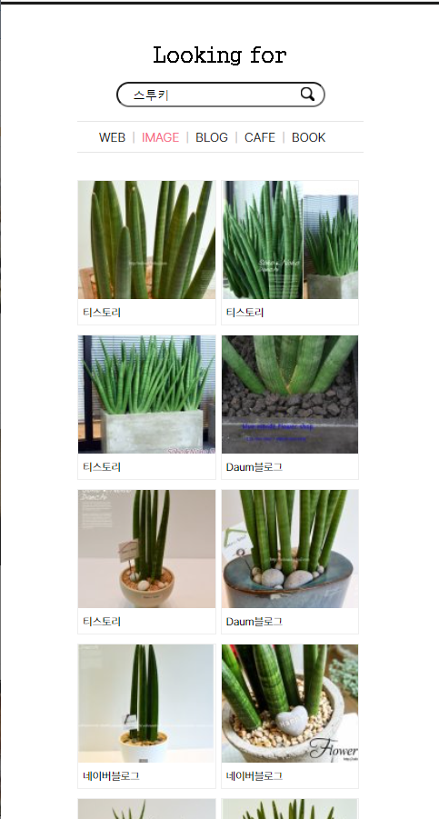
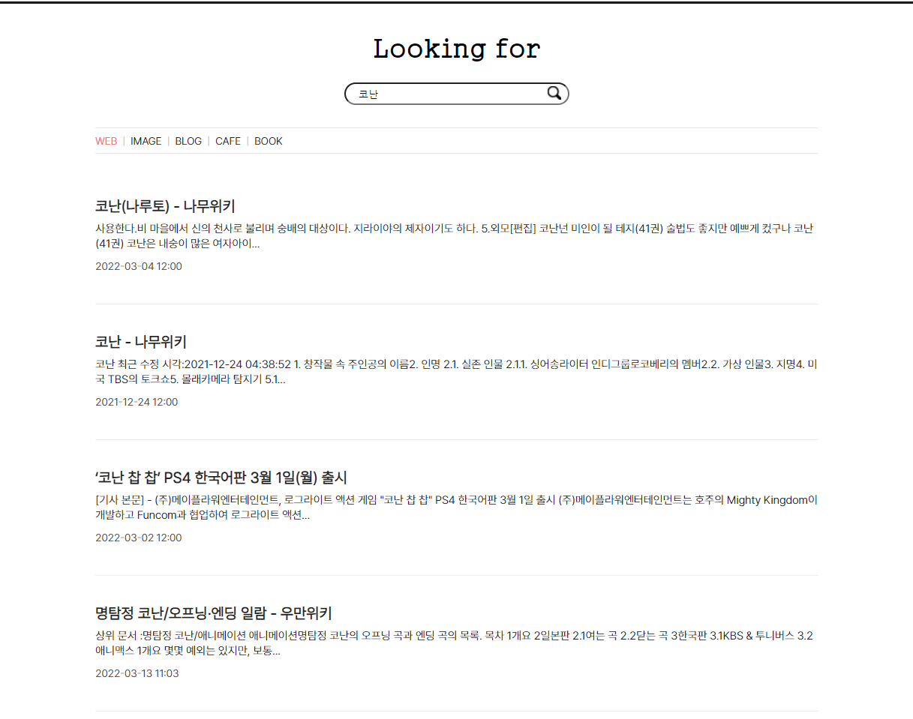
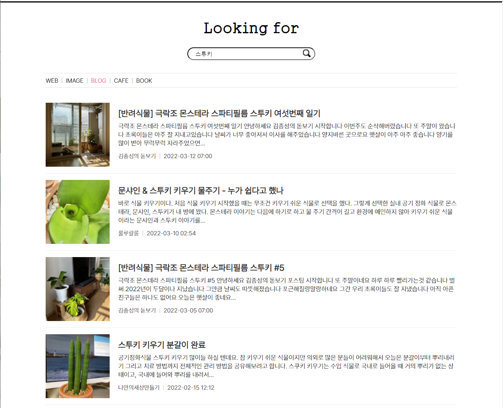
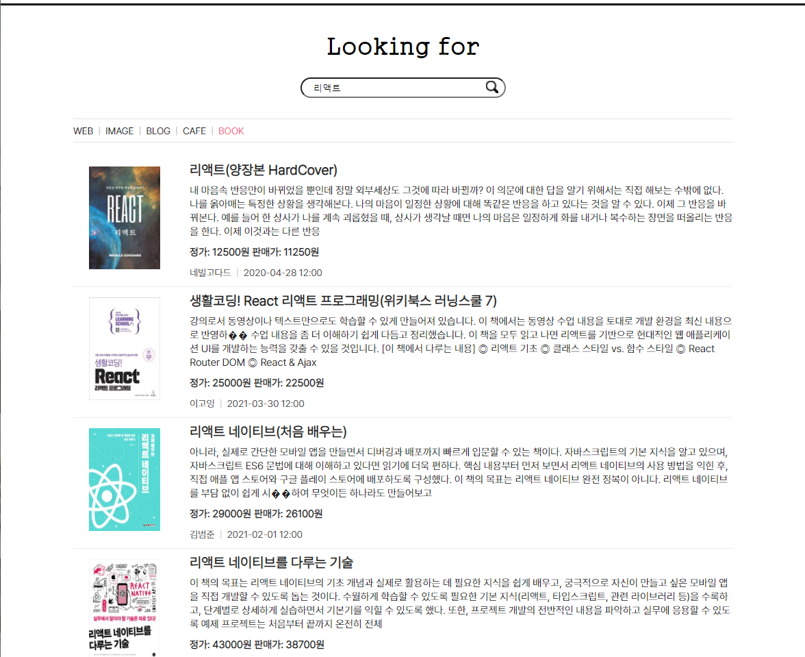

<h1 align="center">Look for❤</h1>
<div align="center">
    
    
</div>

### 👀 [Look for](https://abcabcp.github.io/lookingfor/)

### 2022-03-07 ~ 2022-03-14

## 📢 소개
- 카카오 API를 이용한 웹, 블로그, 카페, 이미지, 책 검색을 할 수 있는 리액트 기반 사이트 입니다.

## ⛏ 구현 기능
- 리덕스 툴킷을 이용한 카카오 API 연동
- 웹, 블로그, 카페, 이미지, 책 검색 
- 데스크탑, 태블릿, 모바일 반응형 처리

<br />

## 🔍 구현화면
### ✔ Main

|desktop|tablet|mobile|
|-----|-----|-----|
||||


### ✔ IMAGE
|desktop|tablet|mobile|
|-----|-----|-----|
||||

### ✔ WEB


### ✔ BLOG


### ✔ CAFE


### ✔ BOOK


<br />

## 📁 폴더 구조

```
├──	src	
│	├── components
│	│   └── Top.js
│	│   └── Meta.js
│	│   └── ImageView.js
│	│   └── ListView.js
│	├── page
│	│   └── Main.js
│	│   └── WebPage.js
│	│   └── BlogPage.js
│	│   └── BookPage.js
│	│   └── CafePage.js
│	│   └── ImagePage.js
│	├── assets
│	│   └── fonts
│	│   └── img
│	│   └── scss
│	│	    └── top.module.scss
│	│	    └── style.module.scss
│	│	    └── font.module.scss
│	│	    └── _mixin.module.scss
│	│	    └── _variables.module.scss
│	├── GlobalStyles.js

```
